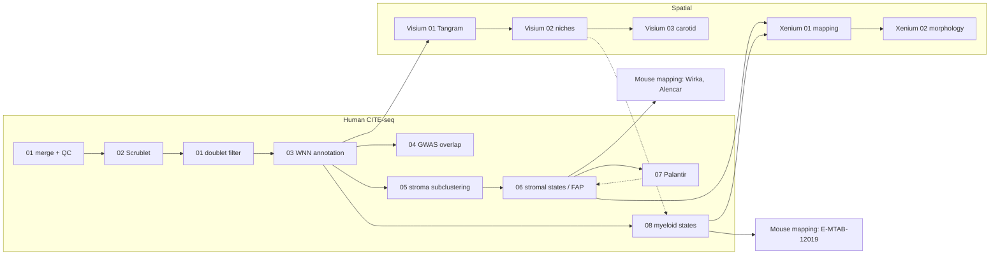

# Targeting modulated vascular smooth muscle cells in atherosclerosis via FAP-directed immunotherapy

[](https://doi.org/10.1126/science.adx1736)
[](https://doi.org/10.1101/2025.03.03.641211)
[](LICENSE)

Analysis code for **Amrute *et al.*, *Science* 392, eadx1736 (2026)**.

We profiled human coronary arteries from explanted hearts with CITE-seq (single-cell RNA plus
surface protein), Visium FFPE and Xenium spatial transcriptomics to build a single-cell and spatial
atlas of coronary artery disease (CAD). The atlas identifies fibroblast activation protein (FAP) as a
marker of modulated vascular smooth muscle cells (fibromyocytes and chondromyocyte-like cells) that
reside in a macrophage-rich neo-intimal niche and derive from medial SMCs. An anti-FAP bispecific
T cell engager (BiTE) reduced plaque burden in mouse models of atherosclerosis and remodelled the
stromal–immune microenvironment through T cell clonal expansion.

---

## Repository structure

```
.
├── human_citeseq/              Human coronary CITE-seq atlas
├── mouse_reference_mapping/    Public mouse datasets projected onto the human atlas
├── spatial/
│   ├── visium/                 Visium FFPE: Tangram deconvolution, meta-programs, niches
│   └── xenium/                 Xenium: single-cell spatial mapping and cell morphology
├── mouse_bite/                 Anti-FAP BiTE treatment in mouse atherosclerosis
├── R/                          Shared helper functions (utils.R)
├── environment/                R package installer and conda environments
├── archive/                    Superseded material kept for provenance
├── CITATION.cff
└── LICENSE
```

Scripts are numbered in run order within each folder. Every script begins with a header describing
its purpose, inputs, outputs, and upstream/downstream scripts. Operations repeated across scripts
(gene-set z-scores, cluster annotation, composition plots, DE table import) live in tested helper
functions in [`R/utils.R`](R/utils.R).

## Analyses

### `human_citeseq/` — human coronary artery CITE-seq atlas

| Script | Description |
| --- | --- |
| `01_merge_qc_doublet_filter.R` | Merge Cell Ranger RNA + ADT output for 27 arteries, QC filtering, doublet removal |
| `02_scrublet_doublet_scores.ipynb` | Per-sample Scrublet doublet scores |
| `03_global_wnn_annotation.R` | RNA + protein WNN integration, global cell-type annotation, markers, composition |
| `04_gwas_celltype_overlap.R` | Overlap of CAD GWAS genes with cell-type marker genes |
| `05_stroma_subclustering.Rmd` | Sub-clustering of SMCs, pericytes and fibroblasts |
| `06_stroma_cell_states_FAP.R` | Stromal cell states, FAP protein–gene correlation network, modulated vs quiescent SMCs |
| `07_stroma_palantir_pseudotime.ipynb` | Palantir pseudotime along the VSMC lineage |
| `08_myeloid_cell_states.R` | Myeloid states, lipid-associated macrophages (Mac4), in vitro foam-cell comparison |

### `mouse_reference_mapping/` — mouse datasets mapped onto the human atlas

| Script | Description |
| --- | --- |
| `mouse_mapping_Wirka2019.R` | SMC lineage-traced atherosclerosis time course (Wirka *et al.* 2019, GSE131776) |
| `mouse_mapping_Alencar2020.R` | Lineage-traced plaque cells from the Owens lab (Alencar *et al.* 2020, PMID 32674599) |
| `mouse_mapping_regression_E-MTAB-12019.R` | Atherosclerosis progression/regression model; myeloid mapping and Mac4 signature |

### `spatial/` — spatial transcriptomics

| Script | Description |
| --- | --- |
| `visium/01_tangram_deconvolution.ipynb` | Tangram mapping of the CITE-seq atlas onto each Visium section |
| `visium/02_visium_ffpe_niches.R` | Spot clustering, NMF meta-programs, spatial niches, PROGENy, FAP module, GWAS genes |
| `visium/03_carotid_metaprogram_comparison.R` | Meta-program comparison with an external carotid plaque dataset |
| `xenium/01_xenium_integration_mapping.R` | Xenium integration and mapping to CITE-seq global and compartment references |
| `xenium/02_xenium_cell_morphology.R` | Cell morphology features across mapped stromal and myeloid states |

### `mouse_bite/` — FAP-directed immunotherapy in mice

| Script | Description |
| --- | --- |
| `01_bite_aorta_scrnaseq.R` | Aortic scRNA-seq, control vs anti-FAP BiTE: cell-type DE, Augur, stromal and myeloid states |
| `02_bite_tcell_tcr.R` | T cell scRNA-seq + TCR-seq: starCAT programs, clonal expansion and diversity |

### Workflow overview



The mouse BiTE analyses (`mouse_bite/`) are independent of the human pipeline.

## Data availability

Data generated in this study are available from GEO:

| Dataset | Accession |
| --- | --- |
| Human coronary artery CITE-seq | [GSE314596](https://www.ncbi.nlm.nih.gov/geo/query/acc.cgi?acc=GSE314596) |
| Human coronary artery Visium FFPE | [GSE314851](https://www.ncbi.nlm.nih.gov/geo/query/acc.cgi?acc=GSE314851) |
| Human coronary artery Xenium | [GSE315246](https://www.ncbi.nlm.nih.gov/geo/query/acc.cgi?acc=GSE315246) |
| Mouse aorta scRNA-seq, anti-FAP BiTE | [GSE314598](https://www.ncbi.nlm.nih.gov/geo/query/acc.cgi?acc=GSE314598) |
| In vitro foam cells (THP-1) scRNA-seq | [GSE314595](https://www.ncbi.nlm.nih.gov/geo/query/acc.cgi?acc=GSE314595) |
| SMCs in foam-cell media | [GSE314600](https://www.ncbi.nlm.nih.gov/geo/query/acc.cgi?acc=GSE314600) |

See the *Data and materials availability* statement of the paper for the complete list. Public
datasets re-analysed here include GSE131776 (Wirka *et al.*), the Owens-lab lineage-tracing data
(Alencar *et al.*), and ArrayExpress E-MTAB-12019.

## Getting started

### Requirements

- R ≥ 4.3 with Seurat and the packages listed in `environment/install_R_packages.R`
- Python (Scanpy ecosystem) for the notebooks; see `environment/*.yml`
- Large-memory machine: ≥ 64 GB RAM is recommended; several steps raise
  `future.globals.maxSize` to 50–100 GB

### Installation

```bash
git clone https://github.com/jamrute/Amrute_FAP_CAD_BiTE_2025.git
cd Amrute_FAP_CAD_BiTE_2025

# R packages (CRAN, Bioconductor and GitHub)
Rscript environment/install_R_packages.R

# Python environments
conda env create -f environment/environment_scrublet_palantir.yml
conda env create -f environment/environment_tangram.yml
```

### Running the analyses

The scripts are interactive analyses written to be run section by section (for example in RStudio),
following the order in the tables above. Before running a script:

1. Download the relevant data (see [Data availability](#data-availability)).
2. Set `repo_dir` at the top of the script to the root of this repository (scripts `source()`
   the shared helpers in `R/utils.R`).
3. Edit the other lines marked `# EDIT` to point to your local data and intermediate objects.
4. Check the script header for the inputs it expects from upstream scripts.

Intermediate objects (`.rds`, `.h5ad`, `.h5Seurat`) are written to the working directory and are
not tracked in this repository.

## Citation

If you use this code, please cite:

> Amrute JM, Jung I-H, *et al.* Targeting modulated vascular smooth muscle cells in
> atherosclerosis via FAP-directed immunotherapy. *Science* **392**, eadx1736 (2026).
> https://doi.org/10.1126/science.adx1736

```bibtex
@article{Amrute2026FAP,
  title   = {Targeting modulated vascular smooth muscle cells in atherosclerosis via {FAP}-directed immunotherapy},
  author  = {Amrute, J. M. and Jung, I.-H. and others},
  journal = {Science},
  volume  = {392},
  pages   = {eadx1736},
  year    = {2026},
  doi     = {10.1126/science.adx1736}
}
```

## License

This code is released under the [MIT License](LICENSE).

## Contact

Junedh M. Amrute — [jamrute@wustl.edu](mailto:jamrute@wustl.edu)

Questions about the code are welcome via [GitHub issues](../../issues).
